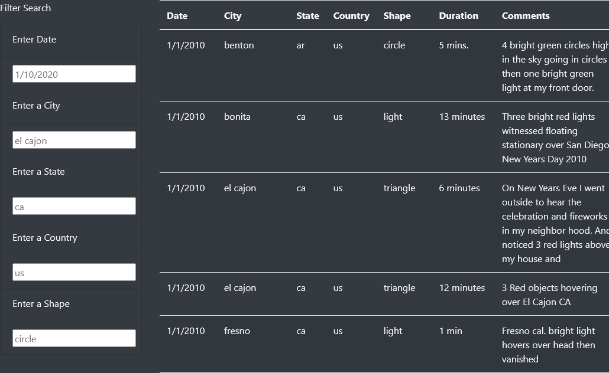

# UFOs

## Overview

This web app is a demonstration of the functionality that JavaScript can bring to a project. Using Bootstrap, custom CSS, HTML, and JavaScript we are able to dynamically display a table and filter it through multiple criteria. 

### Purpose

Dana needed a webpage that would make it easy for users to search through UFO sightings and find the ones they're interested in. We were able to create a dynamic page that is visually appealing and free of clutter. Letting users filter by more than one criteria creates a better user experience and will keep them coming back.

## Results
<!-- There is a description of how to perform a search, with images. -->

Performing a search is done by navigating to a filter text box and typing in what value you want to find matching results for. There are multiple filter boxes, and all can be used at the same time to really narrow down the results.

As is shown in this photo, once you have typed a value into a filter box you can press the return key or change focus from the element. This triggers the update script and filters the table.

This screenshot shows the results of the table after it has been filtered with two filters. There is no special order that needs to be followed, and results can be narrowed down in whatever sequence you want.

## Summary

This project works well as a simple web app, but there is plenty of room for improvement. Ignoring the small dataset, here are my thoughts on it.

### Drawback

One major drawback is that whatever the user types into the filter box needs to match the text in the table exactly. Capitalization must be the same, and any extra spaces will prevent it from working too. 
A rather glaring bug in the app can happen after the page is refreshed. Any text that is in the filter boxes isn't cleared on refresh, and typing in the same text into those boxes doesn't trigger the update function. You have to change the text, press the return key, and then type in the original text again.

### Further Development

For further development I would add a dropdown to the filter box with suggestions based on the data that is in the table. Looser matching of filters to data would help also, there's no reason for capitalization to have to match. The table could use a little bit of formatting, the lack of capitalization for cities, states, and countries looks unprofessional.
